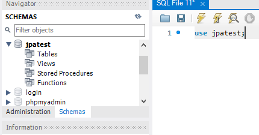
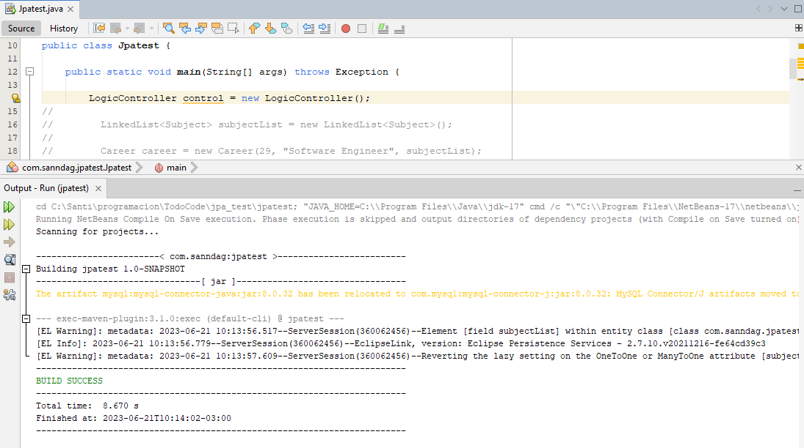
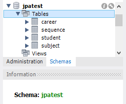
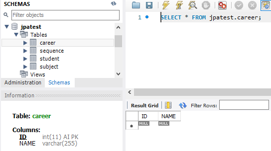
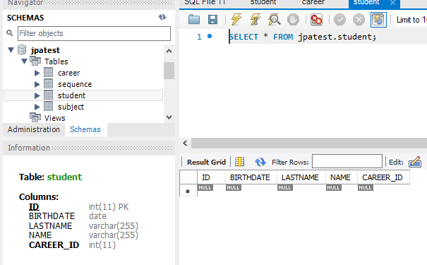
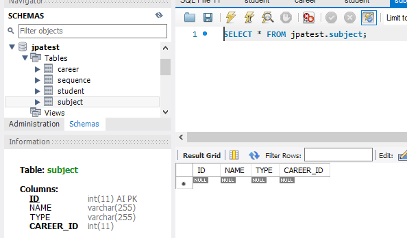
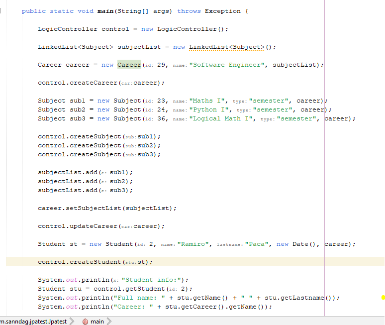
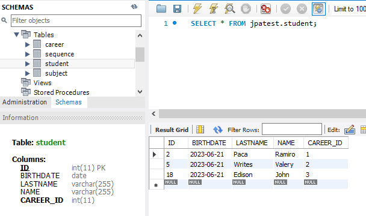
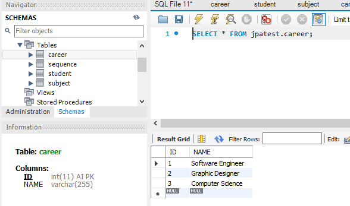
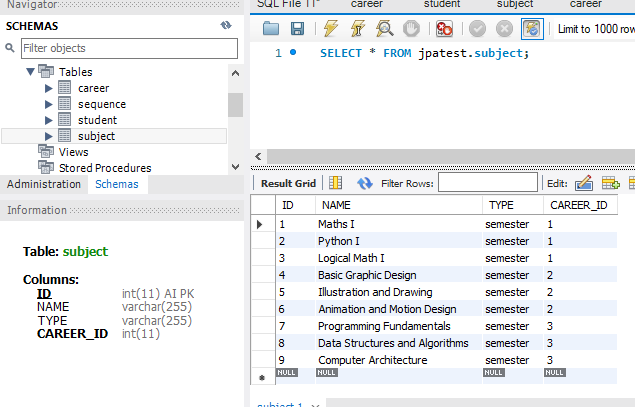

    
    
    

 

# One-to-Many Demo App

The purpose of this mini application is to practice implementing a 'one-to-many' relationship in MySQL. Please note that this app does not include a GUI or API; the students are loaded directly from the main class.

## Demo

The database is empty:
 

 

We execute the code to create the tables in the database.

 

Tables created successfully.
 

 

The 'Career' table is empty.
 

 

The 'Student' table is empty.
 

 

The 'Subject' table is empty.
 

 

Next, I will demonstrate how I loaded the data from the Main class. For testing purposes, I assigned arbitrary ID numbers to the subjects to showcase that the app creates them sequentially:
 

 

List of students. Please note that the date of birth was not modified, as it is irrelevant for our focus, which is the one-to-many relationship between 'Career' and 'Subject,' as well as the many-to-one relationship between 'Subject' and 'Career':
 

 

List of careers:
 

 

List of subjects:
 

 

